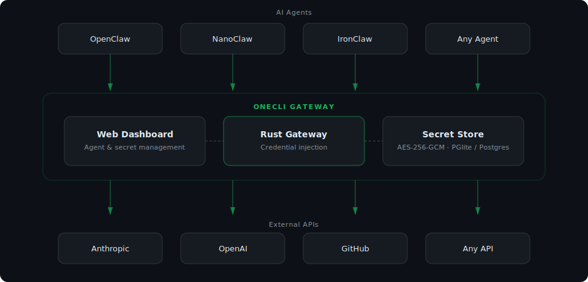

<picture>
  <source media="(prefers-color-scheme: dark)" srcset="assets/onecomputer-logo-dark.gif">
  <source media="(prefers-color-scheme: light)" srcset="assets/onecomputer-logo-light.gif">
  
</picture>

<p align="center">
  <b>Governed AI computers for enterprise builders.</b><br/>
  Turn Claude Code, Streamlit, React, Python, and agent workflows into managed internal apps with identity, policy, evidence, and a kill switch.
</p>

---

> ## ⚠️ Honest current state (2026-06-28 audit)
>
> Much of this codebase was written by an LLM. A rigorous audit on 2026-06-28
> found the advertised **95/100 "controlled-pilot readiness" is largely
> self-assigned theater** — the scorecard was hand-graded by the same author
> that wrote the code. The author's own earlier note admits an honest baseline
> of **25/100**. Real working production-grade code is ~35-40%.
>
> **What actually works:** a Rust MITM HTTPS proxy with a real deny-by-default
> policy engine and a working npmjs.org/pypi.org 403 blocklist; upstream secret
> injection; an AppStream sandbox POC that genuinely mints streaming URLs; a
> read-only Outlook Graph client in a vendored POC.
>
> **What does NOT work (despite docs/commits implying otherwise):** no real
> crypto signer (a constant string), no MCP server, no DID identity at sandbox
> spin-up, no Daytona/E2B adapter, no Claude-Code/Codex/Cowork installer, the
> guardrail enforcement is `simulator_only_not_enforced` and never wired to a
> request gate, the cloud layer is 13 stub files, and `cargo test` "passes" by
> skipping all 8 tests when `DATABASE_URL` is unset.
>
> Full verified findings: [`AUDIT.md`](./AUDIT.md). Read it before trusting any
> "complete" or "ready" claim in this repo.

---

## What is OneComputer?

OneComputer is a fork of OneCLI focused on a sharper enterprise wedge:

> **Deploy AI-built apps and agents quickly, but make them safe enough for CISO.**

The original OneCLI gateway solves credential custody for AI agents. OneComputer keeps that gateway foundation and expands it into a governed runtime and control room for enterprise AI-built software:

- secure deployment for vibe-coded apps from Claude Code / localhost;
- app and agent passports with owner, purpose, data classification, runtime, credentials, and expiry;
- IAM-authenticated access and short-lived trust claims;
- approval gates for risky actions;
- evidence timelines and audit exports;
- live revoke / pause / kill-switch controls.

## Phase 1 wedge demo

The first killer demo is intentionally narrow:

```bash
onecomputer deploy
```

User-visible flow:

1. Detect app type: Streamlit, React, FastAPI, Python, or static bundle.
2. Ask for owner, user group, and data classification.
3. Package and deploy to a managed AWS runtime.
4. Add IAM-backed access and a short-lived OneComputer/VTI-style access claim.
5. Register an app passport.
6. Show the CISO control room: owner, runtime, credentials, policy, evidence, and revoke.

Boardroom line:

> “Here is a random shadow AI app. In five minutes, OneComputer turns it into a governed AI computer with login, owner, scoped access, evidence, and kill switch.”

## Product surfaces

- **Builder UX**: one command and a simple dashboard for business/power users.
- **CISO Control Room**: all AI apps/agents, owners, data access, credentials, risk, evidence, and kill switch.
- **Credential Gateway**: inherited OneCLI-style broker so apps/agents do not hold raw secrets.
- **Trust/Evidence Layer**: policy snapshots, approvals, trace IDs, and audit/export artifacts.
- **Pilot customer path**: InvestmentGini uses OneComputer as its governed AI app/agent runtime.

## Architecture

<picture>
  <source media="(prefers-color-scheme: dark)" srcset="assets/onecomputer-architecture-dark.svg">
  <source media="(prefers-color-scheme: light)" srcset="assets/onecomputer-architecture-light.svg">
  
</picture>

Current fork inheritance:

- **Rust Gateway**: HTTP gateway for transparent credential injection.
- **Web Dashboard**: Next.js app for apps, agents, secrets, policy, activity, and evidence.
- **Secret Store**: encrypted credential storage and brokered injection.
- **Secure Apps lane**: governed AWS Lambda/ECS proof for Claude Code / Streamlit / React deployments.

## Quick start for local development

For a fresh macOS, Linux, or WSL checkout, the recommended OSS path is:

```bash
curl -fsSL https://raw.githubusercontent.com/ONE-Computer/onecomputer/main/scripts/install.sh | sh
```

The installer clones the public repository into `~/.onecomputer/src`, creates a
mode-600 `.env` with local-only secrets, installs locked JavaScript
dependencies, starts PostgreSQL with Docker Compose, applies migrations, and
starts the web/gateway development processes. It is safe to rerun and never
deletes database volumes or overwrites an existing `.env` secret.

To prepare without starting the dev server:

```bash
curl -fsSL https://raw.githubusercontent.com/ONE-Computer/onecomputer/main/scripts/install.sh | sh -s -- --no-start
```

For a checkout you already cloned:

```bash
./scripts/install.sh --source-dir .
```

See [`docs/onecomputer/installation.md`](docs/onecomputer/installation.md)
for supported options, prerequisites, security behavior, and the distinction
between the OSS source path and the Azure deployment path.

### Manual local development

```bash
pnpm install
cp .env.example .env
pnpm db:generate
pnpm db:up
pnpm db:migrate
pnpm dev
```

Dashboard: **http://localhost:10254**  
Gateway: **http://localhost:10255**

> Phase 1 note: internal workspace package scopes still use `@onecli/*` to avoid churn while the product surface is rebranded. See `docs/onecomputer/rebrand-map.md` for the safe migration plan.

## Key docs

- [Phase 1 wedge demo](docs/onecomputer/phase-1-wedge-demo.md)
- [CISO control room](docs/onecomputer/ciso-control-room.md)
- [Rebrand map](docs/onecomputer/rebrand-map.md)
- [Secure app Lambda IAM/VTI proof](docs/secure-apps/lambda-iam-vti-poc.md)
- [Secure app ECS Express proof](docs/secure-apps/ecs-express-sandbox-poc.md)
- [InvGini pilot governance](docs/invgini-agent-governance.md)
- [Secure Cowork Cloud PC / AppStream POC](docs/onecomputer/secure-cowork/appstream-cloud-pc-poc-2026-06-21.md)
- [Windows VM EDA: EC2 + SSM + DCV path](docs/onecomputer/secure-cowork/windows-vm-eda-2026-06-21.md)

## License

This fork preserves the upstream Apache-2.0 license.
