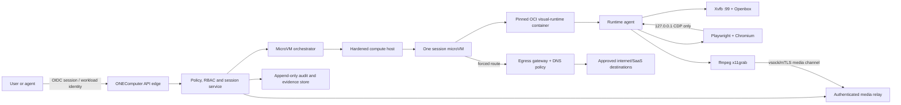
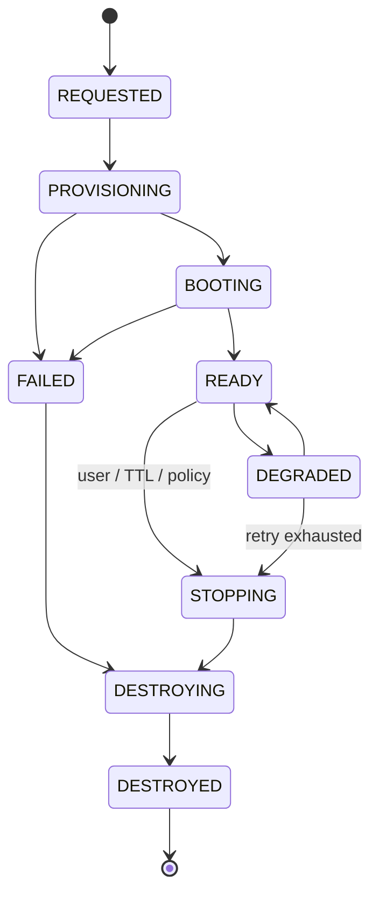
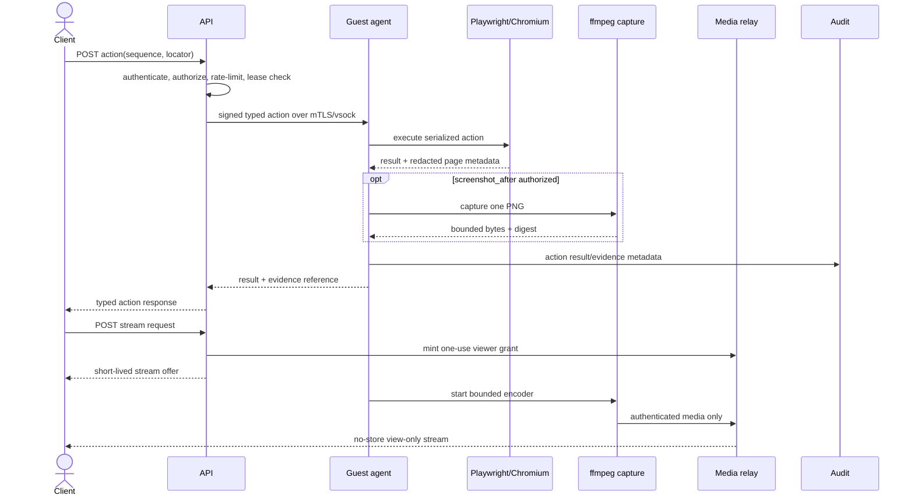

# Headless visual microVM runtime architecture

Status: target architecture and rollout contract

Owner: ONEComputer runtime/security

Last reviewed: 2026-07-15

Decision scope: Linux visual-computer sessions; this document does not approve a specific cloud or microVM provider.

## Executive decision

ONEComputer will run each untrusted visual-computer session as a pinned OCI image **inside an approved, per-session microVM boundary**. The guest image contains Xvfb/X11, Openbox, Chromium, Playwright/CDP support, and ffmpeg. X11 and CDP bind only inside the guest. There is no VNC server, no noVNC/websockify service, no public guest port, and no direct browser-to-guest connection.

The authenticated ONEComputer control plane creates and owns sessions, sends typed browser actions to a guest runtime agent, and returns either an on-demand PNG or a low-latency encoded stream through an authenticated media relay. All guest egress is forced through a separately administered egress gateway. Session state, evidence, and browser profiles are ephemeral by default.

The approved execution choices are:

1. Kata Containers selected through a dedicated Kubernetes `RuntimeClass`, one pod/sandbox per VM; or
2. a provider integration that can attest an equivalent Firecracker-class, per-session microVM boundary.

A plain Docker/container namespace, a provider's unspecified "sandbox," or an OCI image by itself does not satisfy this boundary. Direct Firecracker operation is acceptable only behind a hardened lifecycle service using the jailer, unique host UID/GID, cgroups, seccomp, host network policy, patch management, and evidence collection; ONEComputer must not become a thin wrapper over the raw Firecracker API.

## Facts: current state versus target

The table below is based on repository inspection on 2026-07-15. Some visual files were uncommitted in the shared worktree at inspection time; they are evidence of work in progress, not a released capability.

| Concern         | Verified current Kasm-local state                                                                                                                                                         | Verified current Daytona state                                                                                                                                                              | Required target                                                                                                                                                                 |
| --------------- | ----------------------------------------------------------------------------------------------------------------------------------------------------------------------------------------- | ------------------------------------------------------------------------------------------------------------------------------------------------------------------------------------------- | ------------------------------------------------------------------------------------------------------------------------------------------------------------------------------- |
| Isolation       | `kasm-local-provider.ts` starts a `kasmweb/ubuntu-jammy-desktop:1.16.0` Docker container. No microVM runtime is selected in that provider.                                                | `daytona-service.ts` creates from a snapshot ID through the Daytona API. The request does not choose Daytona's Linux VM runtime, and the adapter cannot prove the resulting isolation mode. | OCI image digest inside an attested, approved microVM per session.                                                                                                              |
| Display         | Kasm image supplies its desktop display; the new visual helper targets `DISPLAY=:1`.                                                                                                      | `sandbox-visual-runtime.ts` can start Xvfb `:99` and Openbox through toolbox exec.                                                                                                          | Xvfb with `-nolisten tcp`; Openbox only; fixed, validated dimensions.                                                                                                           |
| Browser control | Existing Kasm desktop is interactive. In-flight helper starts Chromium with loopback CDP.                                                                                                 | In-flight helper starts Chromium with loopback CDP through shell exec.                                                                                                                      | Playwright service owns Chromium; CDP remains guest-loopback and is never exposed as a tenant API.                                                                              |
| Capture         | Kasm is exposed through KasmVNC on mapped port 6901; the in-flight helper can also capture `:1` with ffmpeg.                                                                              | Existing desktop bootstrap installs TigerVNC/noVNC with `SecurityTypes None`; optional URL configuration is required. In-flight helper captures a PNG with ffmpeg `x11grab`.                | PNG capture and authenticated low-latency stream only; VNC/noVNC prohibited.                                                                                                    |
| Authentication  | API sandbox routes use application auth, organization scoping, ownership checks, and abilities. Kasm's desktop URL is a separate mapped-port surface.                                     | API uses a shared Daytona bearer key for control and toolbox calls. Desktop bootstrap reports `authMode: none`; exposure depends on an optional URL template.                               | End-user auth terminates at ONEComputer; workload identity and short-lived session grants authorize every control/media operation. No shared provider key in a guest or client. |
| Egress          | Kasm bootstrap can configure the ONEComputer gateway proxy and CA, but the container provider does not demonstrate network-level prevention of bypass.                                    | Adapter create request sets snapshot and `autoStop: 60`; it does not request `networkBlockAll` or an allowlist.                                                                             | Default-deny host/provider policy; only DNS and egress-gateway addresses reachable. Proxy settings are convenience, not enforcement.                                            |
| Lifecycle       | Docker create/list/get/restart/delete; database records ownership.                                                                                                                        | Create/poll/bootstrap/list/get/delete; `autoStop: 60`.                                                                                                                                      | Explicit state machine, idempotency, leases, heartbeats, hard TTL, reconciliation, secure destruction, quotas.                                                                  |
| Evidence        | General API audit wraps some create/connect/restart/delete calls. Screenshot/stream reads are not currently audit-wrapped; stream is repeated shell exec and base64 PNG at about 1.3 fps. | Same API behavior; provider responses and bootstrap log tails exist, but no complete signed session manifest is produced.                                                                   | Append-only session/action/media metadata, policy and image digests, trace IDs, lifecycle reasons, and integrity-protected evidence manifest.                                   |

The existing API's `/exec` endpoint accepts an arbitrary shell command. That may remain an administrative/developer capability under a separate high-risk permission, but it is not the target visual-control contract and must not be reachable by ordinary visual-session users.

## Trust boundaries and topology



Trust rules:

- Treat the guest kernel, OCI workload, Chromium renderer, visited content, downloads, and all guest-originated telemetry as hostile.
- Treat the microVM manager, host kernel, orchestrator, image registry, signing roots, policy service, egress gateway, evidence store, and CI signing identity as trusted and separately administered.
- Do not mount the container runtime socket, host filesystem, cloud instance credentials, control-plane credentials, or long-lived secrets into the guest.
- Use a one-session microVM. Do not place mutually distrusting tenants or sessions as multiple containers in one Kata VM.
- Host-to-guest control uses an authenticated vsock channel where available. If provider networking is the only option, use mutually authenticated TLS with a per-session certificate and a network policy that admits only the relay/orchestrator.
- X11 uses a Unix-domain socket inside the guest. Remove `/tmp/.X11-unix` and browser profile state during teardown; never listen on TCP 6000-series ports.
- Chromium CDP binds to `127.0.0.1` in the guest. Only the runtime agent may reach it. A CDP WebSocket URL is bearer-equivalent control of the browser and must never be returned to clients, logged, or routed through provider port exposure.

## Guest runtime image

### Process model

`tini`/init starts one non-root runtime agent. The agent creates a private runtime directory, launches Xvfb, waits for `xdpyinfo`, launches Openbox, then launches Playwright-managed Chromium. The agent supervises every child, reaps zombies, exposes readiness over the authenticated control channel, and terminates the session when a required process dies repeatedly.

The image contains only:

- a minimal supported Linux userspace;
- Xvfb and X11 diagnostic libraries;
- Openbox without panels, file managers, screen lockers, or remote-desktop services;
- a pinned Chromium and matching pinned Playwright version/browser revision;
- ffmpeg built with `x11grab` and the approved stream codecs;
- fonts, CA trust, the runtime agent, and health probes.

The image must not contain VNC, noVNC, websockify, SSH, compilers, package managers in the final stage, `sudo`, setuid tools not explicitly justified, or cloud CLIs. CI fails if prohibited binaries or listeners are found.

### Browser launch baseline

Run Chromium as a non-root UID. Do not normalize `--no-sandbox`; it is present in the in-flight bootstrap because of the current container environment but is a target promotion blocker. The target keeps Chromium's namespace/seccomp sandbox enabled inside the microVM, uses a fresh profile per session, disables password storage and background sync, and sets download and profile directories on an ephemeral quota-controlled volume.

Required launch properties include loopback-only remote debugging, no remote debugging pipe/socket outside the runtime agent, a deterministic viewport and locale when policy requires reproducibility, no extension loading, and enterprise policies that disable credential persistence and unauthorized protocols. GPU acceleration is disabled in the initial CPU-only profile; enabling virtio-gpu is a separate threat-model review.

Playwright is the primary automation API. `connectOverCDP` is allowed only as an implementation seam for attaching to the local Chromium process; Playwright documents that CDP attachment is Chromium-only and lower fidelity than its native protocol. The public ONEComputer contract therefore exposes semantic actions, not raw CDP methods.

### Capture paths

On-demand PNG uses one bounded ffmpeg `x11grab` invocation or an equivalent long-lived capture worker. It captures the Xvfb screen, writes PNG to stdout, validates the eight-byte PNG signature, enforces pixel and byte limits, and never writes an intermediate image to a shared filesystem.

The low-latency path uses one supervised, long-lived ffmpeg process per active viewer set, fed from Xvfb and terminated when the final viewer disconnects. Initial codec is H.264 constrained baseline in fragmented MP4 over an authenticated HTTP stream, or WebRTC when its relay and ICE policy are approved. Recommended starting profile: 1280x800, 8-15 fps, 1-2 Mbps cap, keyframe every 1-2 seconds, no audio. Multipart PNG is permitted only for the pilot at at most 2 fps; it is bandwidth-heavy and must not be described as production low latency.

Media is view-only. Input events are separate authenticated API calls, so a media URL cannot become a control channel. Frames have no public cacheability; relays set `Cache-Control: no-store, private`, `X-Content-Type-Options: nosniff`, strict origin checks, connection and bandwidth caps, and revoke streams immediately when the session lease ends.

## P0: side artifact/computer timeline

The first production slice must provide a Manus-style side artifact that lets an authorized user watch the computer live and inspect what happened before and after each tool call. This is an evidence-backed presentation timeline, not a remote desktop and not a second source of execution truth.

The timeline interleaves:

- sanitized command/tool-call start, incremental output, completion, and failure events;
- X11/browser frames captured before and after a tool call and at bounded intervals while the visible computer changes;
- browser action metadata such as action type, redacted destination, result, and duration;
- lifecycle, policy decision, approval, warning, and terminal-state markers;
- artifact references for authorized screenshots, downloads, reports, or other produced files.

Every displayed item has a stable `event_id`, monotonically increasing per-session `sequence`, session-relative monotonic timestamp, server timestamp, `tool_call_id` where applicable, and evidence linkage. Arrival order is not presentation order: the server orders by `sequence`, detects gaps, and exposes late or corrected events without silently rewriting prior evidence.

### Typed presentation event contract

The canonical envelope is versioned and append-only. Producers submit internal events to the timeline service; clients receive a redacted projection appropriate to their capability and retention policy.

```ts
type PresentationEventV1 = {
  schema: "onecomputer.presentation-event/v1";
  event_id: string;
  session_id: string;
  sequence: number; // strictly increasing within one session
  occurred_at: string; // RFC 3339 server-correlated time
  monotonic_offset_ms: number; // elapsed from session monotonic origin
  trace_id: string;
  span_id?: string;
  tool_call_id?: string;
  parent_event_id?: string;
  classification: "operational" | "confidential" | "restricted";
  retention_class: string;
  evidence: {
    manifest_id: string;
    record_id: string;
    content_sha256?: string;
    previous_record_sha256?: string;
  };
  payload:
    | { type: "tool.started"; tool: string; summary: string }
    | {
        type: "tool.output";
        stream: "stdout" | "stderr";
        chunk: string;
        chunk_sequence: number;
        truncated: boolean;
      }
    | {
        type: "tool.completed";
        outcome: "succeeded" | "failed" | "cancelled" | "unknown";
        exit_code?: number;
        duration_ms: number;
      }
    | {
        type: "browser.action";
        action: string;
        redacted_url?: string;
        outcome: string;
        duration_ms: number;
      }
    | {
        type: "frame.available";
        frame_id: string;
        object_ref: string;
        media_type: "image/png" | "image/webp";
        width: number;
        height: number;
        byte_length: number;
        frame_reason:
          | "tool_before"
          | "tool_after"
          | "visual_change"
          | "manual"
          | "failure";
        supersedes_frame_id?: string;
      }
    | {
        type: "artifact.available";
        artifact_id: string;
        name: string;
        media_type: string;
        byte_length: number;
      }
    | {
        type: "policy.decision";
        decision: "allow" | "deny" | "hold";
        policy_digest: string;
        reason_code: string;
      }
    | { type: "session.state"; state: string; reason_code?: string }
    | {
        type: "timeline.gap";
        first_missing_sequence: number;
        last_missing_sequence: number;
      }
    | {
        type: "timeline.redaction";
        target_event_id: string;
        fields: string[];
        reason_code: string;
      };
};
```

`tool.output` content is UTF-8 after invalid-byte replacement and secret/DLP redaction. A chunk is bounded to 16 KiB; one tool call is bounded by tenant policy and ends with an explicit `truncated: true` marker when output is dropped. ANSI control sequences are parsed by a sandboxed renderer or removed; raw terminal escape sequences never execute in the client. The contract never carries cookies, authorization headers, raw CDP traffic, browser storage, unredacted form values, or arbitrary HTML.

Frames are keyed to tool calls by the envelope's `tool_call_id`. A `tool_before` frame is captured after the call is accepted but before its visible action; `tool_after` is captured after the result or timeout. Long-running visible calls may produce `visual_change` frames, deduplicated by perceptual/content change and capped by policy. Missing capture is represented by a failure marker; it must not delay or change the tool result.

### Storage and evidence linkage

Event metadata and redacted command output are stored in the append-only timeline/evidence log. Screenshot/frame bytes are stored separately in tenant-partitioned encrypted object storage under opaque object keys. The event contains byte length, media type, dimensions, content SHA-256, evidence record, encryption-key reference, and retention class; it does not contain base64 frame data or a permanent public URL.

Clients obtain a short-lived, audience- and event-bound read URL after a fresh authorization check. Object storage denies direct tenant listing, public access, mutable overwrites, and cross-region replication unless policy permits it. Duplicate frame bytes may be content-deduplicated only inside the same tenant and retention class; cross-tenant deduplication is prohibited. Deletion leaves an integrity-preserving tombstone in the manifest while cryptographically erasing or deleting the content object according to policy.

The timeline evidence record links to the same `trace_id`, `tool_call_id`, action sequence, policy digest, image/runtime digest, and session manifest used by control-plane audit. Presentation data is a projection of those records. UI labels must distinguish `recorded`, `late`, `redacted`, `expired`, `capture failed`, and `outcome unknown`; absence of a frame is not evidence that the screen did not change.

### Live follow and scrubbing

```http
GET /v1/visual-sessions/{id}/timeline?after_sequence=418&limit=200
Accept: application/json

GET /v1/visual-sessions/{id}/timeline/live?after_sequence=418
Accept: text/event-stream
```

The paginated endpoint is authoritative for history. The Server-Sent Events feed is a resumable notification/projection channel using event `id` equal to `sequence`; reconnect uses `Last-Event-ID`. The client backfills from the paginated endpoint after a gap, reconnect, or `timeline.gap`. A stream grant is short-lived, reauthorized on connection, tenant/session-bound, read-only, and capped to five minutes before renewal. SSE responses disable intermediary buffering and caching.

The side artifact has two explicit modes:

- **Live follow:** the playhead remains on the newest complete event/frame. New events advance it automatically. User scrolling or selecting an older event exits live follow and displays a clear “return to live” action plus the unread-event count.
- **History:** backward/forward controls move by event, tool call, or frame. The client fetches bounded pages in either direction and prefetches only adjacent metadata and a small number of frame thumbnails. It never downloads the complete frame history by default.

The server returns a timeline watermark containing `highest_committed_sequence` and `highest_observed_sequence`. Clients render only committed events as evidence-backed history; an optional live tail may show observed events as provisional. Corrections append a new event referencing the prior event. Seeking uses sequence/cursor, never client wall-clock alone. If retention has removed a frame, scrubbing still shows its metadata, digest, and `expired` state when policy allows the tombstone to remain.

### Latency and backpressure

P0 internal objectives, to be verified under load, are: p95 tool/lifecycle event visible within 500 ms of commit; p95 post-tool frame available within 1 second of capture request; live reconnect/backfill within 2 seconds for the latest 200 events; and user control/action processing never blocked by timeline delivery.

Each producer writes through a bounded queue. Priority order is terminal state and policy events, tool completion, tool start/action metadata, command-output chunks, then opportunistic visual-change frames. Required evidence metadata is never silently discarded. Under pressure:

1. coalesce adjacent stdout/stderr chunks up to the size bound;
2. deduplicate unchanged frames and drop intermediate `visual_change` frames while retaining before/after/failure frames;
3. lower thumbnail/frame cadence and quality within policy;
4. emit explicit truncation, dropped-frame count, sequence gap, and degradation metrics;
5. disconnect a slow live consumer with a resumable cursor instead of allowing unbounded memory growth;
6. reject new optional viewers or captures before degrading control, teardown, policy, or required evidence paths.

No client-specific queue may retain more than the configured event/byte window. Object upload has a deadline, concurrency limit, and circuit breaker. If frame storage is unavailable, tool execution continues only when content frames are optional; emit `capture failed` metadata and alert. If the append-only evidence log is unavailable, follow the fail-closed rules in this document for new sessions and sensitive actions. Timeline lag, queue depth, output truncation, frames captured/deduplicated/dropped, storage latency/failure, SSE reconnects, gap backfills, slow-consumer disconnects, scrub latency, and live-follow delay are required metrics.

### Retention, redaction, and P0 tests

Retention is assigned per event at ingestion from tenant policy. Command output and frames default to shorter retention than lifecycle and policy metadata. Redaction runs before durable timeline storage and before fan-out; object frames requiring visual redaction are transformed into a new derived object with source linkage and restricted source access. Post-ingestion erasure appends a `timeline.redaction` event and deletes/crypto-erases affected objects without rewriting the audit chain. Legal hold, content evidence, and support access require explicit policy and are fully audited.

P0 cannot ship until tests prove tool/frame correlation across success, timeout, crash, and reconnect; strict sequence and gap recovery; live-follow pause/resume and unread counts; backward/forward cursor pagination; slow-client disconnection and lossless backfill of required metadata; output and ANSI sanitization; secret/DLP redaction before storage and display; cross-tenant denial for events and frame objects; short URL expiry/revocation; frame deduplication and mandatory before/after retention; storage/evidence outage behavior; retention expiry and tombstones; and bounded memory, CPU, storage, and bandwidth under command-output and frame storms.

## Control plane and authorization

The browser or agent authenticates to the ONEComputer API using the platform OIDC/session or workload identity. The API resolves `{organization_id, project_id, principal_id, sandbox_id}`, verifies ownership and capability, evaluates current policy, and mints a short-lived, audience-bound session grant. Provider API keys remain only in the orchestrator secret store.

Minimum capabilities are `visual.session.create`, `visual.session.read`, `visual.control`, `visual.screenshot`, `visual.stream`, and `visual.session.delete`. Read does not imply control. Administrative shell execution is a separate capability. Authorization is repeated on every request and on stream establishment; long streams are revalidated or capped to a five-minute connection before renewal.

Grants must include session ID, principal, tenant, capabilities, policy hash, audience, issued/expiry times, and a unique token ID. TTL is at most five minutes. Use mTLS workload identity between services and per-session guest credentials delivered over the orchestrator boundary, never via image layers, environment listings, command strings, query strings, or browser local storage.

Rate limits apply by principal, tenant, session, and host. State-changing calls require an idempotency key. Cross-tenant identifiers return the same not-found response as absent identifiers.

## API contracts

All endpoints are under `/v1/visual-sessions`; JSON errors use `application/problem+json`. Requests carry `Authorization`, `Idempotency-Key` for mutations, and `traceparent`. Responses include `request_id`, `session_id`, and authoritative state. The examples define the target, not the current route implementation.

### Create and inspect

```http
POST /v1/visual-sessions
Content-Type: application/json

{
  "sandbox_id": "sbx_01...",
  "image_digest": "sha256:...",
  "viewport": { "width": 1280, "height": 800, "device_scale_factor": 1 },
  "locale": "en-SG",
  "ttl_seconds": 1800,
  "egress_policy_id": "egp_01...",
  "evidence_mode": "metadata"
}
```

`202 Accepted` returns `state: "PROVISIONING"`, a status URL, immutable image/policy digests, and expiry. The server chooses only allowlisted image digests and may reject a caller-supplied digest. `GET /v1/visual-sessions/{id}` returns state, readiness components, lease expiry, resource profile, image/policy/guest-kernel digests, and sanitized failure code; it never returns provider credentials, CDP URLs, guest IPs, or raw host errors.

### Semantic control

```http
POST /v1/visual-sessions/{id}/actions
Content-Type: application/json

{
  "sequence": 42,
  "deadline_ms": 10000,
  "action": { "type": "click", "locator": { "role": "button", "name": "Continue" } },
  "evidence": { "screenshot_after": true }
}
```

Supported actions are a versioned allowlist: `navigate`, `click`, `fill`, `press`, `select`, `scroll`, `wait_for`, and narrowly scoped file upload/download operations. Locators are Playwright-style semantic selectors. Arbitrary JavaScript evaluation, raw CDP, shell, unrestricted filesystem paths, and arbitrary browser launch flags are excluded from the user contract. Actions are serialized per browser context; stale or duplicate `sequence` values fail deterministically. The response records start/end monotonic times, result code, resulting URL with secrets redacted, and optional evidence reference.

### Screenshot and stream

```http
GET /v1/visual-sessions/{id}/screenshot?format=png
Accept: image/png

POST /v1/visual-sessions/{id}/streams
Content-Type: application/json

{ "transport": "fmp4", "max_fps": 15, "max_bitrate_kbps": 2000 }
```

Screenshot returns `200 image/png`, `Cache-Control: no-store, private`, `ETag` as a content digest, `X-Captured-At`, `X-Frame-Sequence`, and a bounded body. Stream creation returns a one-use, audience-bound URL or WebRTC offer that expires within 30 seconds; the bearer credential is placed in an authorization header or secure same-site cookie, not the query string. `DELETE /v1/visual-sessions/{id}/streams/{stream_id}` is idempotent.

### Stop/delete and errors

`POST /{id}:stop` changes `READY|DEGRADED` to `STOPPING`; `DELETE /{id}` requests destruction and returns `202` until the reconciler confirms `DESTROYED`. Repeated calls with the same idempotency key return the original result.

Stable error codes include `AUTH_REQUIRED`, `FORBIDDEN`, `NOT_FOUND`, `INVALID_STATE`, `POLICY_DENIED`, `IMAGE_NOT_APPROVED`, `CAPACITY_EXHAUSTED`, `GUEST_BOOT_TIMEOUT`, `BROWSER_UNHEALTHY`, `CAPTURE_UNHEALTHY`, `EGRESS_DENIED`, `ACTION_TIMEOUT`, `RATE_LIMITED`, and `DEPENDENCY_UNAVAILABLE`. A response exposes no command output or visited-page content unless explicitly classified as evidence for the authorized caller.

## Lifecycle and reconciliation



Creation is asynchronous and idempotent. The orchestrator reserves quota, resolves an approved image digest, records policy and runtime configuration, provisions a clean microVM, verifies attestation/runtime class, starts the OCI workload, and waits for guest readiness. A session is `READY` only when Xvfb dimensions match, Openbox and Chromium are alive, Playwright can create a page, capture produces a valid image, and the egress canary proves allowed traffic works and direct bypass does not.

The guest sends a heartbeat every 10 seconds; three misses mark `DEGRADED`. The reconciler, not an API request, owns transitions and cleanup. Startup has a two-minute pilot deadline and a measured production SLO. Every session has an idle lease and a hard TTL; user activity may extend idle time within the hard TTL. Policy revocation or tenant suspension stops control and media immediately, then destroys the session.

Destruction first revokes grants and network access, closes streams, terminates the guest, and then deletes ephemeral disks, browser profiles, vsock credentials, host TAP state, and orchestrator records that are not evidence. Destruction is retried until confirmed. A tombstone retains tenant, session ID, digests, times, reason, and deletion confirmation, but no browsing content. Host loss is reconciled as failed and destroyed; sessions are not live-migrated in the initial release.

## Network and egress enforcement

Firecracker explicitly leaves traffic filtering to the host. Consequently, proxy environment variables and Chromium proxy flags are insufficient. Enforce all of the following outside the guest:

- no public IP and no inbound route to the microVM;
- host/provider firewall default deny;
- only the approved DNS resolver, control/media service endpoint, time source if required, and egress-gateway address reachable;
- anti-bypass rules for direct IP, alternate DNS, DNS-over-HTTPS/TLS, QUIC/UDP 443, IPv6, link-local/metadata endpoints, private RFC1918 ranges, multicast, and other tenant/session networks;
- egress gateway authenticates workload identity, applies tenant/agent policy, performs destination and method controls, malware/DLP inspection where approved, and emits correlated decisions;
- governed SaaS connectors are reachable only through the ONEComputer gateway. Credentials are injected at that gateway and never released to Chromium or the guest;
- DNS rebinding is handled by resolving at the enforcement point, pinning/continuously validating resolved IPs, and blocking private/link-local destinations after resolution.

Daytona documents sandbox CIDR/domain allowlists and a `networkBlockAll` option, but the current adapter uses none of them. A Daytona implementation must set an enforceable deny-by-default network policy at creation, prove its effective runtime type, and pass bypass tests. Provider allowlists complement rather than replace the ONEComputer egress gateway.

## Resource controls and denial-of-service safety

Initial standard profile: 2 vCPU, 2 GiB RAM, 4 GiB ephemeral disk, 1280x800x24 display, at most 128 processes/threads subject to Chromium tuning, 1 Mbps sustained/2 Mbps burst media, and policy-defined egress bandwidth. These are rollout starting points, not performance claims; load tests determine production profiles.

Enforce guest/microVM CPU quota and weight, memory hard limit with no host swap for sensitive workloads, pids limit, disk/inode quota, open-file limit, locked-memory limit, network token buckets, action queue depth, screenshot concurrency, stream count, encoder CPU, and output body size. The host reserves capacity for the VMM, orchestrator, and teardown. Admission control rejects work rather than overcommitting into unsafe host pressure.

Firecracker deployments use jailer cgroups and resource limits in addition to guest sizing. Kata deployments set pod requests equal to guaranteed reservations where practical, pod limits, ephemeral-storage quota, `RuntimeClass` overhead, topology-spread/anti-affinity, and node taints so ordinary containers cannot land on microVM nodes.

## Image and host supply chain

1. Build from a reviewed Dockerfile with version-pinned base image digest and package snapshot. Use a hermetic, rootless multi-stage build.
2. Generate SPDX or CycloneDX SBOM and provenance; scan OS packages, language dependencies, Chromium, Playwright, and ffmpeg. Fail on policy-defined critical/high vulnerabilities unless a time-bounded, owner-approved exception exists.
3. Run secret scanning, license policy, prohibited-binary/listener checks, non-root and read-only-rootfs tests, and an image smoke test under the actual microVM runtime.
4. Sign the image digest and provenance with the release identity. Admission verifies signature, issuer, repository, workflow, source commit, SBOM presence, and approved digest. Tags are never deployment authority.
5. Promote the same digest through dev, staging, and production. Record image, guest kernel/initrd/rootfs or Kata artifact, VMM/runtime, host OS, and policy digests in every session manifest.
6. Patch on an emergency SLA based on exploitability. Roll back by approved digest. Expired or revoked artifacts fail admission. Maintain a canary pool before fleet rollout.

The microVM host is immutable or image-based, minimal, dedicated, measured, and automatically patched. KVM device access is limited to the runtime. Disable unneeded host services, use unique jail identities for direct Firecracker, collect kernel/VMM audit data, and prevent CI or tenant workloads from accessing production hosts. Snapshot/restore is disabled initially because browser memory and credentials can be captured; enabling it requires encrypted, authenticated snapshots, provenance, anti-rollback, key lifecycle, and cross-tenant remanence tests.

## Evidence, privacy, and retention

Each session produces an integrity-protected manifest containing tenant/project/session IDs; principal and workload identity references; requested and effective resource profile; microVM/runtime class and host-pool identity; image, kernel/runtime, configuration, and egress-policy digests; state transitions; grant IDs; action type/result/timing; destination decisions; stream start/stop metadata; failure and teardown reason; and trace/span IDs.

Do not log raw CDP messages, keystrokes, form values, cookies, authorization headers, download contents, full URLs with query/fragment, screenshots, video, or page DOM by default. Operational evidence mode stores metadata only. Content evidence requires explicit policy, purpose, user notice where applicable, encryption with tenant-scoped keys, tightly scoped read audit, retention expiry, and legal/privacy review. A screenshot record stores its content digest and object reference; the audit chain must not embed base64 image bodies.

Use an append-only/WORM-capable evidence sink with server-side timestamps, hash chaining or signed checkpoints, encryption, tenant partitioning, and documented retention/deletion. Integrity proves what ONEComputer recorded; it does not prove page truth. Clock skew is monitored; monotonic time measures action durations.

## Observability and SLOs

Propagate W3C trace context from API through orchestrator, provider, guest agent, egress gateway, media relay, and evidence writer. Structured logs use stable event names and redact at source.

Minimum metrics:

- request counts/latency/errors by API operation and stable error code;
- active sessions by state, tenant tier, runtime class, image digest, and host pool (never user ID as a metric label);
- admission wait, microVM boot, guest readiness, first-action, screenshot, and first-frame latency;
- heartbeat misses, child restarts, Chromium crashes, renderer OOMs, ffmpeg exits, dropped/duplicated frames, stream bitrate and viewer count;
- host CPU steal, memory pressure/OOM, disk/inodes, KVM/VMM failures, and capacity headroom;
- egress allow/deny/error counts and attempted bypass class;
- teardown age, leaked TAP/cgroup/volume detection, evidence-write failures, and reconciliation backlog.

Pilot service objectives to validate, not promise externally: 99.5% successful session readiness, p95 readiness under 60 seconds with a warm image cache, p95 screenshot under 1 second, p95 action acknowledgement under 250 ms excluding page work, first stream frame under 2 seconds, and 99.9% teardown confirmation within five minutes. Evidence-write failure and failed grant revocation page immediately; no session may become `READY` while required audit/evidence sinks are unavailable unless an explicitly approved fail-safe mode exists.

## Failure handling

- Xvfb/Openbox failure: one supervised restart; if display identity/dimensions change, restart Chromium and capture, mark `DEGRADED`, then fail after the bounded retry budget.
- Chromium/Playwright failure: preserve metadata, terminate the browser process group, create a fresh profile only if policy allows a clean retry; never silently continue with ambiguous action state.
- Action timeout: cancel at Playwright level, return `ACTION_TIMEOUT`, capture metadata (and content only if authorized), and preserve sequence ordering. A timed-out mutating web action is `outcome_unknown` unless a deterministic postcondition is verified.
- ffmpeg/media failure: screenshots may remain available; stream becomes `DEGRADED`; restart encoder with exponential backoff and circuit breaking. Limit restart storms.
- Egress gateway unavailable: fail closed for navigation and governed connectors. Existing page rendering may continue only under policy; do not fall back to direct internet.
- Evidence sink unavailable: stop new sessions and sensitive actions; buffer only bounded encrypted metadata, never unbounded frame content.
- Provider/API `429` or transient error: honor retry headers, exponential backoff with jitter, idempotency keys, and a tenant-fair queue.
- Host loss: revoke grants, mark sessions failed, reconcile provider resources, and require a new session. Never claim action completion from an unconfirmed guest.
- Suspected escape or cross-tenant signal: isolate the node, revoke all node session identities, preserve host evidence, destroy affected guests, remove the node from service, and invoke incident response. Do not reuse it based only on a health check.

## Sequences

### Session creation and readiness

```mermaid
sequenceDiagram
    actor User
    participant API as ONEComputer API
    participant Policy
    participant Orch as Orchestrator
    participant VM as MicroVM runtime
    participant Guest as Guest agent
    participant Egress
    participant Audit
    User->>API: POST visual session + idempotency key
    API->>Policy: authorize tenant, capability, image, egress
    Policy-->>API: allow + immutable policy digest
    API->>Audit: record request
    API->>Orch: create desired session
    API-->>User: 202 PROVISIONING
    Orch->>VM: provision one microVM + pinned OCI digest
    VM->>Guest: boot workload; deliver one-use identity
    Guest->>Guest: Xvfb -> Openbox -> Playwright/Chromium -> capture probe
    Guest->>Egress: allowed canary and bypass-negative probe
    Egress-->>Guest: policy decisions
    Guest-->>Orch: authenticated READY + component versions
    Orch->>Audit: manifest checkpoint
    User->>API: GET session
    API-->>User: READY + digests, no guest endpoint
```

### Action, evidence, and stream



## Threat model

| Threat                                           | Primary controls                                                                                                            | Required verification                                                                                         |
| ------------------------------------------------ | --------------------------------------------------------------------------------------------------------------------------- | ------------------------------------------------------------------------------------------------------------- |
| Browser/renderer or guest escape                 | Per-session hardware virtualization, patched VMM/kernel, Chromium sandbox, non-root/read-only guest, no host mounts/devices | Run escape-oriented hardening checks; confirm runtime class and no dangerous mounts/capabilities per session. |
| Cross-tenant access/IDOR                         | Tenant-scoped DB lookup, capability checks, opaque IDs, identical not-found behavior, per-session identity                  | Attempt read/control/stream/delete across users, projects, orgs, and stale grants.                            |
| CDP takeover                                     | Loopback-only CDP, no port exposure, semantic API, redaction                                                                | Scan guest/host/service exposure; prove CDP is unreachable from tenant and peer sessions.                     |
| VNC/noVNC reintroduction                         | Prohibited packages, listeners, ports, ingress policy, CI image checks                                                      | Assert no VNC/websockify binaries/processes and no 5900/6080/6901 listeners/routes.                           |
| Data exfiltration or gateway bypass              | Host/provider default deny, forced egress identity, DNS/IP/IPv6/QUIC controls, credential injection at gateway              | Test direct IP, alternate DNS/DoH, IPv6, UDP 443, metadata, private ranges, DNS rebinding, and proxy unset.   |
| SSRF to control/metadata plane                   | No guest route, metadata/link-local deny, separate control network, authenticated vsock/mTLS                                | Probe common metadata and internal control addresses from Chromium and shell test harness.                    |
| Malicious web page drives privileged host action | Media is view-only; typed actions terminate in guest; no host clipboard/filesystem/device bridge                            | Fuzz action schema and file paths; verify page cannot call control endpoints or forge session grants.         |
| Token/cookie leakage                             | Secrets stay at gateway; ephemeral browser profile; log/URL redaction; short grants                                         | Canary-secret scans across logs, metrics, evidence, crash dumps, image layers, and client responses.          |
| Image/snapshot compromise                        | Digest pinning, signatures/provenance/SBOM, admission, no mutable tags, snapshot disabled initially                         | Tampered/unsigned/wrong-issuer/expired image and rollback tests.                                              |
| Resource exhaustion                              | Admission control, microVM/cgroup quotas, output and queue bounds, fair scheduling                                          | CPU/memory/pids/disk/inode/fork bomb, decompression bomb, stream fan-out, and screenshot storm tests.         |
| Evidence tampering or overcollection             | Append-only store, signed checkpoints, least-content default, encryption/retention/RBAC                                     | Modify/reorder/delete audit records; verify detection, access audit, expiry, and tenant separation.           |
| Orphaned session after failure                   | Lease/TTL, reconciler, revocation-first teardown, leak detector                                                             | Kill API/orchestrator/host during every lifecycle transition and confirm bounded cleanup.                     |

Residual risk includes hypervisor and host-kernel vulnerabilities, Chromium zero-days, malicious-but-allowed destinations, visual data exposure to authorized viewers, and traffic-analysis leakage. The runtime reduces blast radius; it does not make arbitrary browsing trustworthy. High-risk tenants may require dedicated hosts or confidential-computing controls after separate validation.

## Rollout gates

### Phase 0 — contract and current-state containment

- Label Kasm/noVNC and Daytona desktop paths as legacy/current, not target microVM visual runtime.
- Do not publicly expose Daytona `authMode: none` desktops or Kasm mapped ports beyond the approved local/staging boundary.
- Add API contract, state-machine, evidence schema, image policy, provider capability interface, and explicit `isolation: verified_microvm | unverified` field.
- Block production admission when isolation is unverified.

Exit: threat model approved; no target claim depends on provider marketing or an unchecked runtime label.

### Phase 1 — single-host security prototype

- Build and sign the minimal OCI image; remove VNC/noVNC and `--no-sandbox`.
- Run under Kata `RuntimeClass` or hardened Firecracker lifecycle service.
- Implement typed control, PNG endpoint, metadata evidence, forced egress, quotas, TTL/reconciler, and negative network tests.
- No persistent profiles, uploads, downloads, clipboard, audio, GPU, or snapshots.

Exit: all isolation, auth, egress-bypass, supply-chain, teardown, and resource-abuse tests pass on the actual runtime.

### Phase 2 — authenticated streaming canary

- Add bounded fMP4 or approved WebRTC relay, one-use viewer grants, connection renewal/revocation, and stream observability.
- Canary to internal users on dedicated nodes; compare capture latency, CPU, memory, and bandwidth with SLO candidates.
- Exercise node drain, host loss, gateway loss, evidence outage, and rollback.

Exit: no cross-tenant result, no orphaned resources, and measured capacity model with alert/runbook coverage.

### Phase 3 — limited production

- Tenant quotas, regional pools, image canary/promotion, on-call ownership, vulnerability SLA, incident response, privacy retention, cost controls, and disaster-recovery reconciliation.
- Independent security review and penetration test; remediate all critical/high findings or document time-bounded risk acceptance.
- Gradually increase tenant percentage with automatic rollback on readiness, crash, egress, evidence, or cleanup error budgets.

Kasm/Daytona legacy routes are retired only after capability parity and migration evidence. Do not silently reinterpret an old VNC desktop as a target session.

## Test and release matrix

Every release runs unit, contract, integration, image, runtime, adversarial, load, and chaos suites. Production promotion requires immutable evidence from the same digest and runtime artifacts.

1. **API/RBAC:** schema fuzzing, malformed bodies, replayed idempotency keys, expired/wrong-audience grants, role matrix, IDOR, CSRF/origin for cookie clients, stream revocation, and rate limits.
2. **Browser semantics:** each action, ordering, cancellation, navigation races, popups, downloads, crash recovery, deterministic viewport, Unicode/IME, and `outcome_unknown` handling.
3. **Capture/media:** PNG signature/dimensions/limits, blank/rapidly changing pages, ffmpeg death, slow viewer/backpressure, fan-out cap, disconnect cleanup, codec compatibility, and no caching.
4. **Isolation:** actual Kata/Firecracker attestation, unique VM per session, non-root/read-only root, seccomp/capabilities, no host/socket/device mounts, peer-session scanning, host reboot, and known-container-escape regression corpus.
5. **No VNC/CDP exposure:** package/process/listener scans plus external network scans for 5900/6080/6901/9222 and X11 TCP.
6. **Egress:** allow case and all bypass cases listed in the threat model, including DNS rebinding and governed-connector direct access. Test with browser APIs and a privileged test fixture inside the guest.
7. **Supply chain:** reproducibility where feasible, SBOM/provenance/signature verification, malicious base/image, mutable tag, revoked key, stale Chromium, embedded secret, and admission rollback tests.
8. **Resources:** fork bomb, memory pressure, disk/inode fill, huge page/canvas, zip bomb, screenshot storm, stream fan-out, network flood, noisy-neighbor fairness, and host-reserved capacity.
9. **Lifecycle/chaos:** kill every component during each state transition, duplicate/reordered provider callbacks, provider 429/5xx, partition, clock skew, node drain/loss, partial delete, evidence outage, and egress outage.
10. **Evidence/privacy:** field allowlist/redaction, canary secrets, tenant-key separation, append-only tamper detection, legal hold/expiry/delete, read-access audit, and content-evidence opt-in.
11. **Performance/capacity:** cold/warm boot, first action/frame, screenshot, action throughput, encoder profiles, density, sustained soak, and cost per active/idle session. Publish measured percentiles with hardware/runtime versions.

Release evidence includes test report, source commit, OCI and SBOM digests, signature/provenance verification, guest kernel/Kata or Firecracker versions, host image, policy digest, vulnerability report, canary metrics, rollback result, and named approvers. A UI screenshot or successful health flag is not release evidence by itself.

## Provider acceptance checklist

Before approving Kata, managed Firecracker, Daytona, or another provider for production, obtain machine-verifiable answers for:

- exact runtime/isolation mode per session and whether one VM can contain multiple tenants;
- guest kernel/VMM versions, patch SLA, host tenancy, and dedicated-host option;
- OCI digest selection and artifact/signature verification;
- ingress disabled by default and enforceable egress/DNS/IPv6/UDP policy;
- control-plane and toolbox authentication, tenant isolation, audit/export, key rotation, and regional/data-retention behavior;
- CPU/memory/pids/disk/network limits and noisy-neighbor behavior;
- lifecycle idempotency, leases, hard TTL, delete semantics, remanence, snapshots, and incident response;
- attestation or independent evidence that ONEComputer can store per session.

If the provider cannot prove the boundary, report `isolation: unverified` and fail production admission. Daytona's documentation describes both a default Linux container runtime and a Linux VM runtime; selecting a snapshot alone is not proof that the VM runtime was used.

## Normative references

- [Firecracker design and sandboxing](https://github.com/firecracker-microvm/firecracker/blob/main/docs/design.md): production use through jailer, seccomp/cgroups/namespaces, logs/metrics, and the explicit requirement for host-level traffic filtering.
- [Firecracker production host setup](https://github.com/firecracker-microvm/firecracker/blob/main/docs/prod-host-setup.md): unique UID/GID, resource limits, host hardening, and remanence considerations.
- [Kata Containers architecture](https://github.com/kata-containers/kata-containers/blob/main/docs/design/architecture/README.md): OCI/CRI compatibility, hardware-virtualized isolation, shim v2, and Kubernetes `RuntimeClass` selection.
- [Daytona architecture](https://www.daytona.io/docs/en/architecture/), [sandboxes](https://www.daytona.io/docs/en/sandboxes/), and [network limits](https://www.daytona.io/docs/en/network-limits/): provider control/compute plane, available container/VM runtime descriptions, OCI-backed snapshots, resources, and egress controls. These describe provider capabilities; they do not prove the configuration used by the current ONEComputer adapter.
- [Playwright `BrowserType`](https://playwright.dev/docs/api/class-browsertype): Chromium CDP attachment and its lower-fidelity limitation relative to Playwright protocol.
- [FFmpeg x11grab device](https://ffmpeg.org/ffmpeg-devices.html#x11grab): X11 display/region capture and frame-rate/video-size controls.

## Explicit non-goals

- No VNC, noVNC, KasmVNC, websockify, RDP, SSH, public X11, or public CDP in the target visual path.
- No guarantee that Kasm-local or today's Daytona adapter already provides microVM isolation.
- No raw arbitrary shell/CDP/JavaScript API for ordinary visual users.
- No persistent browser profile, clipboard, microphone, camera, audio, USB, GPU, host filesystem, Docker socket, or cloud metadata in the initial release.
- No claim that a cryptographic audit manifest proves the semantic truth of a third-party page or the success of an ambiguous remote action.
