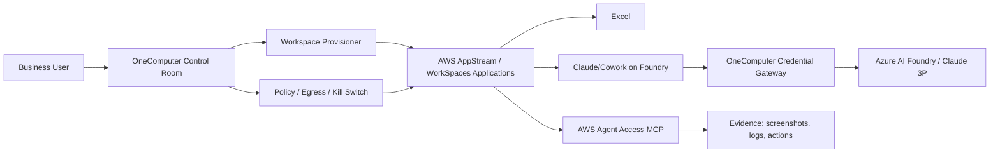

# OneComputer Secure Cowork Cloud PC POC — AWS AppStream / WorkSpaces Applications

Date: 2026-06-21 SGT  
Canonical workstream: **OneComputer**  
Pilot / reference customer: InvestmentGini

## Executive summary

The former InvestmentGini “Secure Cowork” workstream is now part of **OneComputer**.

The product idea is a governed cloud computer for enterprise users: OneComputer provisions a secure Windows workspace with Excel + Claude/Cowork, preconfigures Claude for enterprise/3P inference, routes secrets through a managed gateway, controls egress/exfiltration, and records evidence/screenshots through Agent Access.

This is not an InvGini-specific feature anymore. InvGini is the first pilot/workload.

## What was proven

1. **AWS AppStream / WorkSpaces Applications can provide the cloud GUI.**
   - Managed Windows streaming session with browser access.
   - Agent Access MCP can drive the session and capture screenshots.
   - Excel launched successfully in AppStream runtime and image-builder sessions.

2. **Claude Desktop / Cowork can run on a Windows AppStream image-builder.**
   - Running the installer inside a normal fleet user session hit UAC and is the wrong path.
   - Correct path is image-builder Administrator install, then capture a golden image.
   - Claude installer succeeded in image-builder Administrator context.

3. **Claude 3P / Azure Foundry policy configuration works.**
   - Claude launched to the Foundry onboarding page: “Welcome to Claude on Foundry”.
   - Policy path used: `HKLM:\SOFTWARE\Policies\Claude`.
   - Non-secret policy keys used:
     - `inferenceProvider = foundry`
     - `inferenceFoundryResource = jimmy-mo4lusn8-swedencentral`
     - `inferenceCredentialKind = static`
     - `inferenceFoundryApiKey = onecli-managed`
     - `inferenceModels` includes `claude-sonnet-4-6` and `claude-opus-4-6`

4. **Image Assistant registration works after two gotchas.**
   - AppStream app launch paths cannot use `.cmd`; use `.bat` or `.exe`.
   - Explicit PNG icons via `--absolute-icon-path` avoid create-image icon validation failures.
   - Registered apps:
     - `Excel` -> `C:\Program Files\Microsoft Office\root\Office16\EXCEL.EXE`
     - `ClaudeFoundry` -> `C:\InvGiniBootstrap\launch-claude-foundry.bat`

5. **Agent Access MCP is a viable validation/control surface.**
   - Endpoint pattern: `https://agentaccess-mcp.ap-southeast-1.api.aws/mcp`
   - SigV4 service: `agentaccess-mcp`
   - Required header: `X-Amzn-AgentAccess-Streaming-Session-Url: <AppStream streaming URL>`
   - Observed tools included screenshot, click, type, key, scroll, drag variants.

## Current AWS state at migration

Two image-capture attempts exist:

```text
Old image:     invgini-secure-cowork-excel-claude-20260621-1507      PENDING
Old builder:   invgini-secure-cowork-poc-builder                     SNAPSHOTTING

Rebuild image: invgini-secure-cowork-excel-claude-20260621-rebuild1901 PENDING
Rebuild builder: invgini-secure-cowork-poc-builder2-1901              SNAPSHOTTING
```

Both images have `Excel` and `ClaudeFoundry` registered and no AWS image errors at migration time. The rebuild is the preferred path because it was cleaner and started later.

AWS refused to stop/delete the old stuck resources:

- `StopImageBuilder` rejected the old builder because it was `SNAPSHOTTING`; AWS only allows stop from `RUNNING`.
- `DeleteImage` rejected the old image because it was `PENDING`; AWS requires `AVAILABLE` for delete.

## Secret / key handling rule

Never bake real Claude/Azure/OpenAI keys into:

- AppStream image
- Windows registry at image-build time
- Git/repo files
- memory/GBrain
- screenshots
- command logs

The golden image should contain only the placeholder:

```text
inferenceFoundryApiKey = onecli-managed
```

Runtime key-loading plan:

1. OneComputer/OneCLI gateway or session bootstrap injects `CLAUDE_FOUNDRY_API_KEY`, or
2. AppStream machine role reads `/onecomputer/secure-cowork/claude-foundry-api-key` from AWS Secrets Manager, or
3. fallback remains `onecli-managed` and logs that managed injection is pending.

The session-start hook path is:

```text
C:\AppStream\SessionScripts\invgini-session-start.ps1
```

Future rename should change this to a OneComputer path, e.g.:

```text
C:\OneComputer\SessionScripts\onecomputer-session-start.ps1
```

## Product reframing for OneComputer

OneComputer should treat this as a **Cloud PC / agentic workspace product surface**, not as an InvGini-only automation:

- OneComputer provisions governed desktops/workspaces.
- Users can run Excel, Claude/Cowork, browser apps, and internal tools.
- OneComputer preloads trusted MCP/connectors and enterprise policy.
- OneComputer owns credentials, egress policy, evidence, screenshots, and kill switch.
- AppStream/WorkSpaces Applications is one runtime backend; Daytona/other VM providers are alternatives.

## Architecture pattern



## Follow-up backlog

### P0 — finish current AWS POC

- Poll rebuild image until `AVAILABLE` or failed.
- If `AVAILABLE`, create/update a fleet from `invgini-secure-cowork-excel-claude-20260621-rebuild1901`.
- Validate via Agent Access:
  - launch Excel;
  - launch ClaudeFoundry;
  - confirm Foundry screen and/or configured model path;
  - capture safe screenshots.

### P1 — OneComputer-ize names and scripts

- Rename paths from `InvGiniBootstrap` to `OneComputerBootstrap`.
- Rename `ClaudeFoundry` app and scripts under OneComputer namespace.
- Move AWS runbooks into this repo as first-class OneComputer docs/scripts.

### P1 — managed secret injection

- Create least-privilege role/policy for AppStream machine role.
- Create Secrets Manager entry for Claude Foundry key.
- Ensure session-start hook loads the key without printing it.
- Add evidence log that only records key presence/length/hash prefix, never plaintext.

### P1 — security guardrails

- Egress allowlist: Azure Foundry/Claude endpoints, OneComputer gateway/control plane, required AWS endpoints.
- Block consumer Microsoft/Outlook/webmail/upload surfaces unless explicitly approved.
- Disable uncontrolled file upload from cloud workspace to public web.
- Keep raw screenshots with presigned URLs out of user-facing artifacts.

### P2 — runtime abstraction

- Model AppStream as one backend behind OneComputer `WorkspaceRuntime`.
- Add alternatives: Daytona, EC2 + DCV, WorkSpaces Personal, Windows 365/Azure Virtual Desktop.
- Preserve a single OneComputer policy/evidence/credential gateway across backends.

## Evidence inventory

Safe screenshots in NanoClaw workspace:

```text
/workspace/agent/reports/screenshots/aws-secure-cowork/safe/claude-foundry-configured-image-builder-safe.png
/workspace/agent/reports/screenshots/aws-secure-cowork/builder-excel-03-launched.png
```

Dedicated AWS POC repo retained for raw runbooks/logs:

```text
/workspace/agent/repos/aws-secure-cowork-poc
```

Do not publish raw command-prompt screenshots that contain presigned URLs.
