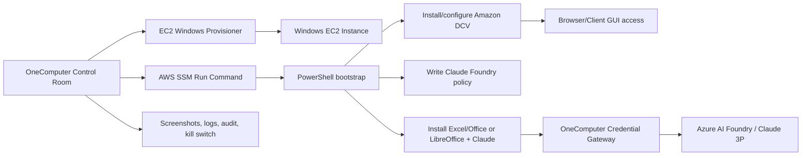

# OneComputer Windows VM EDA — Secure Cowork pivot

Date: 2026-06-21 SGT
Canonical workstream: OneComputer
Project label: Windows VM EDA
Pilot/reference customer: InvestmentGini

## Decision

Terence decided to put AWS AppStream / WorkSpaces Applications image capture on the back burner because snapshotting is slow and not fully controllable. Check AppStream again tomorrow, but stop the frequent polling loop.

Canonical direction now: **most predictable path with full control**:

```text
Windows EC2 + SSM Run Command / PowerShell + Amazon DCV + OneComputer Gateway
```

## Why AppStream is on back burner

AppStream findings:

- AppStream is good as a managed final packaging/runtime option.
- It is poor for fast iteration because image-builder snapshots can get stuck in `SNAPSHOTTING` / image `PENDING` for hours.
- AppStream has no native SSM-like arbitrary PowerShell command channel into an image builder/session.
- Image Assistant CLI can create/register images, but it runs inside the image builder and still ends in slow snapshotting.
- Session scripts can run PowerShell, but for On-Demand fleets they effectively require being embedded in the image first.
- WinRM/PowerShell remoting is possible only if preconfigured via AD/GPO/local admin/network; not default.
- Agent Access MCP is useful for GUI control/evidence, but it is click/type/screenshot automation, not a native command channel.

Current AppStream state when parked:

```text
Old image:       invgini-secure-cowork-excel-claude-20260621-1507        PENDING
Old builder:     invgini-secure-cowork-poc-builder                       SNAPSHOTTING

Rebuild image:   invgini-secure-cowork-excel-claude-20260621-rebuild1901 PENDING
Rebuild builder: invgini-secure-cowork-poc-builder2-1901                 SNAPSHOTTING
```

A one-shot AppStream status check is scheduled for 2026-06-22 09:00 SGT. The previous 15-minute polling loop was cancelled.

## What AppStream still proved

Even though AppStream is no longer the fast POC loop, keep these learnings:

- Claude can be installed in image-builder Administrator context.
- Claude Foundry/3P policy loads via `HKLM:\SOFTWARE\Policies\Claude`.
- Claude displayed “Welcome to Claude on Foundry”.
- Excel launched.
- Registered apps were `Excel` and `ClaudeFoundry`.
- `.cmd` is invalid for AppStream app launch path; `.bat` or `.exe` works.
- Explicit PNG icons via `--absolute-icon-path` avoid Image Assistant icon validation failure.
- Do not bake real API keys into images, registry, screenshots, logs, git, memory, or GBrain; use `onecli-managed` placeholder and runtime injection.

## Windows VM EDA target architecture



## Why Windows EC2 + SSM + DCV is preferred for EDA

- EC2 gives full lifecycle control: create, stop, terminate, AMI, security groups, IAM role, disk size.
- SSM Run Command can execute PowerShell remotely without RDP/WinRM setup if SSM agent + IAM role are present.
- DCV gives remote desktop / GUI streaming without AppStream image capture.
- Debug loop is minutes, not hours.
- We can bootstrap and rerun scripts idempotently.
- Once stable, package into AMI or revisit AppStream only for final managed streaming packaging.

## Proposed POC phases

### Phase 0 — AWS prerequisites

- Confirm default VPC/subnet/security group or create dedicated OneComputer VPC resources.
- Create/attach EC2 IAM role with:
  - `AmazonSSMManagedInstanceCore`
  - read-only access to required S3 installer bucket/path
  - least-privilege Secrets Manager access for Claude Foundry key later.
- Use a Windows Server 2022 AMI with SSM agent.

### Phase 1 — headless bootstrap via SSM PowerShell

PowerShell bootstrap should:

- create `C:\OneComputerBootstrap`;
- download/stage Claude installer;
- install Claude all-users;
- write Claude Foundry policy under `HKLM:\SOFTWARE\Policies\Claude` with `onecli-managed` placeholder;
- install/configure DCV server;
- install browser/Office/LibreOffice as needed;
- write logs to `C:\OneComputerBootstrap\logs` without secrets;
- return clear success/failure status via SSM command output.

### Phase 2 — GUI validation

- Connect through DCV.
- Launch Claude and confirm Foundry onboarding/config.
- Launch Excel/Office equivalent.
- Capture safe screenshots.

### Phase 3 — OneComputer productization

- Register the VM as a OneComputer Workspace Passport:
  - owner, purpose, runtime, data classification, credentials, expiry, kill switch.
- Add OneComputer gateway injection for 3P inference credentials.
- Add egress/exfiltration controls.
- Add evidence pack: SSM command IDs, screenshots, bootstrap logs, policy snapshot.

## Security rules

- Never persist plaintext Claude/Azure/OpenAI keys.
- Do not expose presigned URLs in screenshots or docs.
- Use `onecli-managed` placeholder in durable artifacts.
- Runtime secret injection only from OneComputer gateway or AWS Secrets Manager role.
- Prefer allowlisted egress and explicit deny for webmail/file-upload exfiltration surfaces.

## Immediate next action

Start a new OneComputer Windows VM EDA runbook/script set for EC2 Windows + SSM PowerShell + DCV, while AppStream snapshots are parked until tomorrow’s status check.
